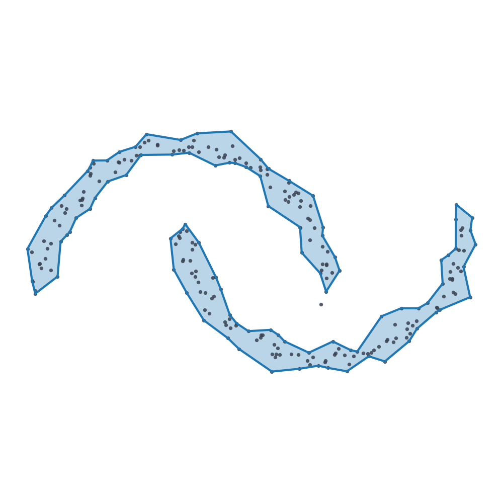
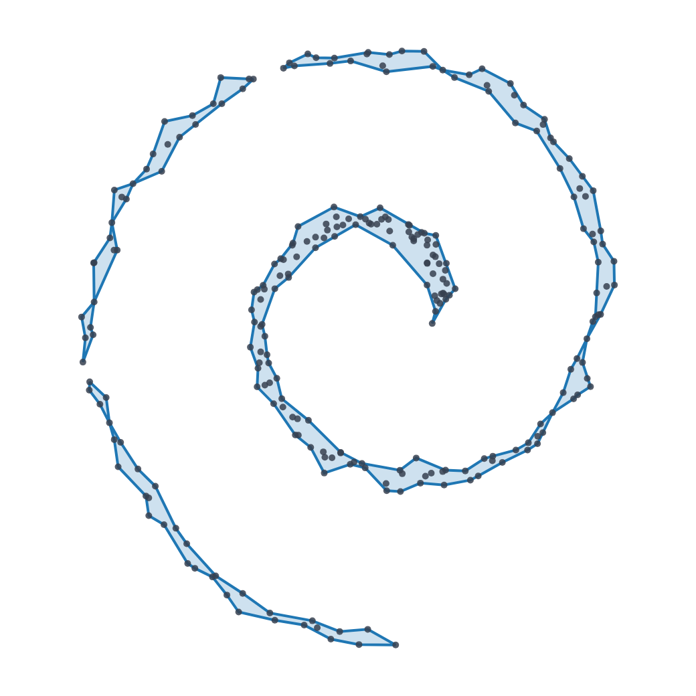

<a id="readme-top"></a>

<!--
*** README based on the Best-README-Template:
*** https://github.com/othneildrew/Best-README-Template
-->

[![Contributors][contributors-shield]][contributors-url]
[![Forks][forks-shield]][forks-url]
[![Stargazers][stars-shield]][stars-url]
[![Issues][issues-shield]][issues-url]
[![MIT License][license-shield]][license-url]

<!-- PROJECT LOGO -->
<br />
<div align="center">
  <h3 align="center">ashp</h3>

  <p align="center">
    Fast alpha shapes (concave hulls) for Python — a maintained, numba-accelerated fork of <a href="https://github.com/bellockk/alphashape">alphashape</a>.
    <br />
    <a href="#usage"><strong>Explore the docs »</strong></a>
    <br />
    <br />
    <a href="apps/dashboard">Interactive Dashboard</a>
    &middot;
    <a href="https://github.com/arunoruto/ashp/issues/new?labels=bug">Report Bug</a>
    &middot;
    <a href="https://github.com/arunoruto/ashp/issues/new?labels=enhancement">Request Feature</a>
  </p>
</div>

<!-- TABLE OF CONTENTS -->
<details>
  <summary>Table of Contents</summary>
  <ol>
    <li>
      <a href="#about-the-project">About The Project</a>
      <ul>
        <li><a href="#built-with">Built With</a></li>
      </ul>
    </li>
    <li>
      <a href="#getting-started">Getting Started</a>
      <ul>
        <li><a href="#prerequisites">Prerequisites</a></li>
        <li><a href="#installation">Installation</a></li>
      </ul>
    </li>
    <li><a href="#usage">Usage</a></li>
    <li><a href="#performance">Performance</a></li>
    <li><a href="#interactive-dashboard">Interactive Dashboard</a></li>
    <li><a href="#roadmap">Roadmap</a></li>
    <li><a href="#contributing">Contributing</a></li>
    <li><a href="#license">License</a></li>
    <li><a href="#contact">Contact</a></li>
    <li><a href="#acknowledgments">Acknowledgments</a></li>
  </ol>
</details>

<!-- ABOUT THE PROJECT -->
## About The Project

[![Effect of the alpha parameter][product-screenshot]](assets/img/alpha_sweep.png)

An **alpha shape** generalises the convex hull of a point cloud: as `alpha`
increases, the hull is carved inward to follow the actual shape of the data —
useful for concave hulls, boundary extraction, and footprint generation in 2-D
and 3-D.

`ashp` is a maintained fork of Kenneth E. Bellock's excellent
[`alphashape`](https://github.com/bellockk/alphashape) library. It keeps the
original API while adding:

* A **numba-accelerated** circumradius core (JIT-compiled, disk-cached, parallel
  for large meshes) — see [Performance](#performance).
* Modern **`uv`** packaging with the `uv_build` backend.
* An interactive **Streamlit + Plotly** dashboard for exploring alpha shapes.

<p align="center">
  
  
</p>

<p align="right">(<a href="#readme-top">back to top</a>)</p>

### Built With

* [![Python][python-shield]][python-url]
* [![NumPy][numpy-shield]][numpy-url]
* [![SciPy][scipy-shield]][scipy-url]
* [![Numba][numba-shield]][numba-url]
* [![Shapely][shapely-shield]][shapely-url]
* [![Streamlit][streamlit-shield]][streamlit-url]
* [![Plotly][plotly-shield]][plotly-url]

<p align="right">(<a href="#readme-top">back to top</a>)</p>

<!-- GETTING STARTED -->
## Getting Started

### Prerequisites

* Python 3.13+
* [uv](https://docs.astral.sh/uv/) (recommended) or pip

### Installation

Add it to your project:

```bash
uv add ashp            # or: pip install ashp
```

Optional `geopandas` support:

```bash
uv add "ashp[geo]"
```

Or work on the project itself:

```bash
git clone https://github.com/arunoruto/ashp.git
cd ashp
uv sync                # project + test group
uv run pytest          # 13 tests
```

<p align="right">(<a href="#readme-top">back to top</a>)</p>

<!-- USAGE EXAMPLES -->
## Usage

```python
from ashp import alphashape, optimizealpha

points = [(0., 0.), (0., 1.), (1., 1.), (1., 0.),
          (0.5, 0.25), (0.5, 0.75), (0.25, 0.5), (0.75, 0.5)]

# Fixed alpha (larger = tighter / more concave; 0 = convex hull):
shape = alphashape(points, alpha=2.0)        # -> shapely geometry

# Or let the solver pick the tightest alpha that keeps every point:
best = optimizealpha(points)
shape = alphashape(points, best)
```

`alphashape` accepts 2-D points (returns a shapely `Polygon` / `LineString` /
`Point`), 3-D points (returns a `trimesh.Trimesh`), a `MultiPoint`, or a
`geopandas.GeoDataFrame`.

A small CLI is included too:

```bash
ashp input_points.geojson output_shape.geojson --alpha 2.0
```

<p align="right">(<a href="#readme-top">back to top</a>)</p>

## Performance

Two hot paths were optimised relative to the original implementation:

* The **per-simplex circumradius** computation is JIT-compiled with
  [numba](https://numba.pydata.org/) and cached to disk, parallelising across
  cores for large meshes. If numba is not installed, it transparently falls
  back to numpy.
* The **boundary reconstruction** is fully vectorised for every dimension
  (numpy set logic for the perimeter facets in place of a per-simplex Python
  loop), plus bulk shapely geometry construction in 2-D instead of building
  shapely objects one edge at a time. Biggest effect in 2-D; 3-D/N-D get a
  smaller speed-up with byte-identical output.

Together these take a single 4000-point `alphashape` call from ~1031 ms (the
original pure-Python / `np.matrix` implementation) to **~72 ms — roughly 14×**,
with bit-identical output. The first call in a fresh environment pays a one-time
numba compilation cost before the cache is warm.

<p align="right">(<a href="#readme-top">back to top</a>)</p>

## Interactive Dashboard

A [Streamlit](https://streamlit.io/) app (using [Plotly](https://plotly.com/))
lives in [`apps/dashboard`](apps/dashboard) for exploring how `alpha` and the
input distribution shape the result:

```bash
uv run --group dashboard streamlit run apps/dashboard/app.py
```

The gallery images above are produced by `assets/generate_images.py` (written to
`assets/img/`):

```bash
uv run --group dashboard python assets/generate_images.py
```

<p align="right">(<a href="#readme-top">back to top</a>)</p>

<!-- ROADMAP -->
## Roadmap

- [x] numba-accelerated circumradius core
- [x] Interactive Streamlit + Plotly dashboard
- [x] Documentation gallery image generator
- [ ] True 2-D holes (interior rings) in the reconstruction
- [ ] Interactive 3-D mesh viewer in the dashboard
- [ ] Published documentation site

See the [open issues](https://github.com/arunoruto/ashp/issues) for a full list
of proposed features and known issues.

<p align="right">(<a href="#readme-top">back to top</a>)</p>

<!-- CONTRIBUTING -->
## Contributing

Contributions are what make the open source community such an amazing place to
learn, inspire, and create. Any contributions you make are **greatly
appreciated**.

1. Fork the Project
2. Create your Feature Branch (`git checkout -b feature/amazing-feature`)
3. Commit your Changes (`git commit -m 'Add some amazing feature'`)
4. Push to the Branch (`git push origin feature/amazing-feature`)
5. Open a Pull Request

Please run `uv run pytest` before opening a PR.

<p align="right">(<a href="#readme-top">back to top</a>)</p>

<!-- LICENSE -->
## License

Distributed under the MIT License. See [`LICENSE`](LICENSE) for more
information. Original work © Kenneth E. Bellock.

<p align="right">(<a href="#readme-top">back to top</a>)</p>

<!-- CONTACT -->
## Contact

Mirza Arnaut - mirza.arnaut45@gmail.com

Project Link: [https://github.com/arunoruto/ashp](https://github.com/arunoruto/ashp)

<p align="right">(<a href="#readme-top">back to top</a>)</p>

<!-- ACKNOWLEDGMENTS -->
## Acknowledgments

* **[alphashape](https://github.com/bellockk/alphashape) by Kenneth E. Bellock**
  — the original project this fork is built on. All of the core alpha shape
  algorithm is his work; `ashp` only modernises packaging and accelerates the
  hot path.
* [Edelsbrunner, Kirkpatrick & Seidel — *On the shape of a set of points in the plane* (1983)](https://doi.org/10.1109/TIT.1983.1056714)
* [Best-README-Template](https://github.com/othneildrew/Best-README-Template)
* [Shields.io](https://shields.io)

<p align="right">(<a href="#readme-top">back to top</a>)</p>

<!-- MARKDOWN LINKS & IMAGES -->
[contributors-shield]: https://img.shields.io/github/contributors/arunoruto/ashp.svg?style=for-the-badge
[contributors-url]: https://github.com/arunoruto/ashp/graphs/contributors
[forks-shield]: https://img.shields.io/github/forks/arunoruto/ashp.svg?style=for-the-badge
[forks-url]: https://github.com/arunoruto/ashp/network/members
[stars-shield]: https://img.shields.io/github/stars/arunoruto/ashp.svg?style=for-the-badge
[stars-url]: https://github.com/arunoruto/ashp/stargazers
[issues-shield]: https://img.shields.io/github/issues/arunoruto/ashp.svg?style=for-the-badge
[issues-url]: https://github.com/arunoruto/ashp/issues
[license-shield]: https://img.shields.io/github/license/arunoruto/ashp.svg?style=for-the-badge
[license-url]: https://github.com/arunoruto/ashp/blob/main/LICENSE
[product-screenshot]: assets/img/alpha_sweep.png
[python-shield]: https://img.shields.io/badge/python-3776AB?style=for-the-badge&logo=python&logoColor=white
[python-url]: https://www.python.org/
[numpy-shield]: https://img.shields.io/badge/numpy-013243?style=for-the-badge&logo=numpy&logoColor=white
[numpy-url]: https://numpy.org/
[scipy-shield]: https://img.shields.io/badge/scipy-8CAAE6?style=for-the-badge&logo=scipy&logoColor=white
[scipy-url]: https://scipy.org/
[numba-shield]: https://img.shields.io/badge/numba-00A3E0?style=for-the-badge&logo=numba&logoColor=white
[numba-url]: https://numba.pydata.org/
[shapely-shield]: https://img.shields.io/badge/shapely-2E4053?style=for-the-badge
[shapely-url]: https://shapely.readthedocs.io/
[streamlit-shield]: https://img.shields.io/badge/streamlit-FF4B4B?style=for-the-badge&logo=streamlit&logoColor=white
[streamlit-url]: https://streamlit.io/
[plotly-shield]: https://img.shields.io/badge/plotly-3F4F75?style=for-the-badge&logo=plotly&logoColor=white
[plotly-url]: https://plotly.com/
